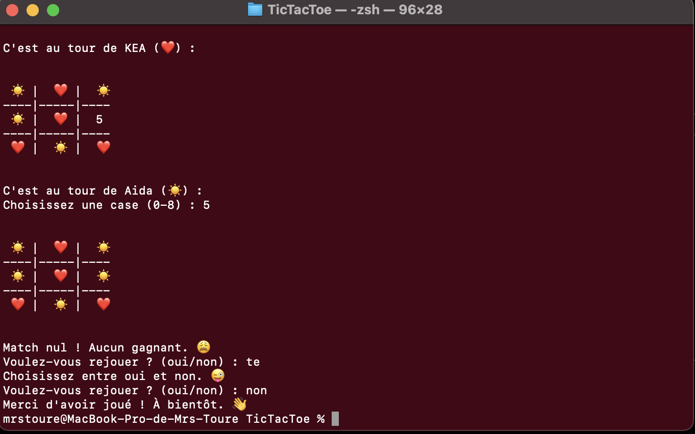

# Tic Tac Toe Game ( Morpion )



## Project Description

This is a Tic Tac Toe (Morpion) game created in Python. Players can compete against each other or challenge an AI opponent named KEA (Khady Elodie Aida). The game features a graphical terminal interface enhanced with emojis for a more engaging experience.

## Demo

Playing the game: [Live Demo](https://www.youtube.com/watch?v=k8i1VQO9OT4)

## 🎮 Features

- Two Player Mode : Play Tic Tac Toe with a friend on the same device.
- Single Player Mode : Challenge KEA, an AI bot with different difficulty levels:
  - Easy : KEA plays randomly.
  - Difficult : KEA plays strategically using winning combinations:
    - Prioritizes the center 🏁.
    - Controls the corners .
    - Blocks opponent's winning move .
    - Focuses on winning whenever possible .
- Emoji-Based Board : The game board uses ❤️ (Player 1) and 🔅 (Player 2 / AI) for a more fun and intuitive experience.
- Game Reset : Restart the game with a fresh board or quit anytime.

## Technologies and tools Used

- Python: Main programming language.

## Prerequisites

Before running this project, ensure you have the following installed:

- Python 3.x

## Installation Steps

1. Clone this repository:
   ```bash
   git clone https://github.com/aida-niang/TicTacToe.git
   ```

## Usage

Run the game with:
```bash
python3 main.py
```

## Project Structure

```
📂 TicTacToe
├── bot.py               # Winning combinations and AI algorithm for KEA's moves  
├── grid.py              # Manages the game board and updates it with player marks  
├── main.py              # Main game logic, handling player interactions and mechanics  
├── players.py           # Handles player setup, including number of players and difficulty selection  
├── victory_check.py     # Checks if a player has won the game  
├── .gitignore           # Excludes unnecessary files (e.g., temporary or local data)  
└── README.md            # Project documentation  


```

## Detailed File Descriptions
- bot.py : Implements the AI logic for KEA, including strategies for different difficulty levels.
- grid.py : Creates and updates the 3x3 Tic Tac Toe board, managing player moves.
- main.py : The entry point of the game. Manages game flow, player turns, and interactions.
- players.py : Handles player setup, including player names, numbers, and AI difficulty selection.
- victory_check.py : Checks for winning conditions, verifying if a player has won or if the game is a draw.
- .gitignore : Specifies files that should be ignored by version control.
- README.md : Provides project documentation.

## Contributing

This project was developed by:
- [Aida NIANG](https://github.com/aida-niang/)
- Elodie BOWEREN
- Khady NDIAYE

## License

This project is licensed under the MIT License - see the [LICENSE](LICENSE) file for details.

## Acknowledgments

Thanks to everyone who contributed to the development of this game!

## Built With

- Python 3.8

## Contact

**Aida NIANG** 
- I'm in : [LinkedIn](https://linkedin.com/in/aidabenhamathniang)
- Contact me : [Email](mailto:aidam.niang@gmail.com  )
- Project Link: [Portfolio](https://aida-niang.students-laplateforme.io)

